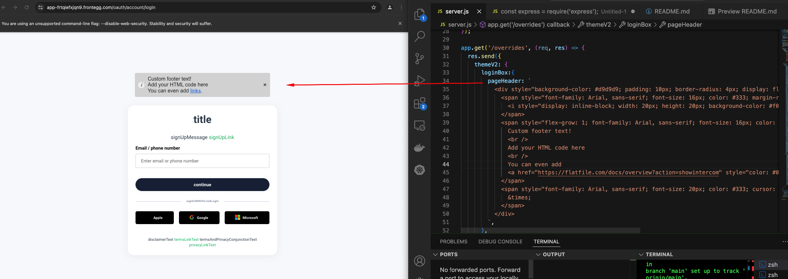

# Frontegg Hosted Login Box Customization Overrides Server

This project includes a Node.js server designed to manage metadata overrides for customizing the Frontegg login box.

In hosted mode, it is necessary to deploy a server or Lambda function. When the login box is loaded, Frontegg will send a GET request to your server to retrieve the appropriate localizations.


## Prerequisites

- Node.js and npm (or yarn) installed on your development machine.
- A Frontegg account with a project and environment set up.


## Setup

1. Use the Frontegg builder to achieve the desired visual style for your login box, such as color changes, font choices, and logo placements.


2. Clone this repo and choose a hosting platform like Heroku or a similar service that suits your needs. Deploy your code to the chosen platform. Once deployed, obtain the publicly accessible URL of your server. It should look like https://yourserveraddress/overrides.

3. Follow the instructions [here](https://developers.frontegg.com/sdks/customizations/configuration#customization-in-the-hosted-mode)  to implement Frontegg Metadata Overrides and connect your hosted login box to the server.

4. Load your hosted login box (The `Login URL` from `Frontegg Portal ➜ [ENVIRONMENT] ➜ Env Settings page`, followed by `/account/login`). For example - `https://app-frtqiefxjqn9.frontegg.com/oauth/account/login`. You should see the settings are applied.

5. If you do not see the settings applied, open the network tools, refresh the page, and search for a request from `/overrides` to see if your server was called. You can also search for the call from `/metadata?entityName=adminBox` to verify that your are passing `metadataOverrides` under `configuration` as required.

```

"metadataOverrides": {
    "url": "https://yourserveraddress/overrides"
}

```

## Testing Locally

If you want to test locally and avoid CORS issues, you can run the server on Chrome with the following command on Mac for example:
```
/Applications/Google\ Chrome.app/Contents/MacOS/Google\ Chrome --disable-web-security --user-data-dir="~/ChromeDev"
```
This will disable web security in Chrome, allowing local requests to bypass CORS restrictions temporarily.

Use this method for development and testing only. For production, host the server on a publicly accessible domain.

## Final result
Here is an example where we add a custom header to the page on top of the login box we created in the Frontegg builder.

We also change the text for the different input fields, lebels etc'.



